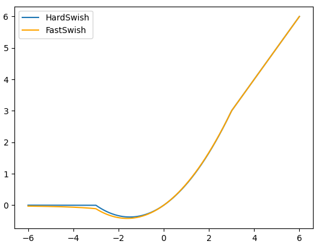
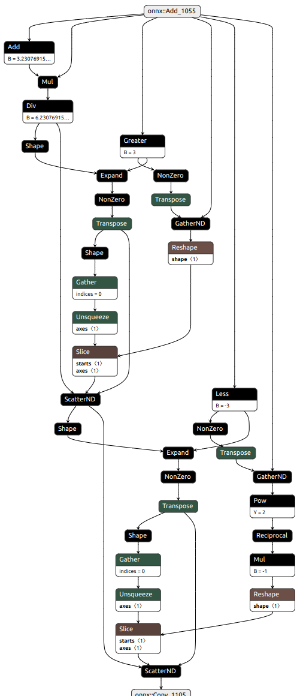

# Introduction

The goal of this little experiment is to play with and learn about various methods to boost the training and inference speed of a simple deep neural network.

Due to hardware limitations, all evaluations were conducted on a single GPU machine with the following specifications:
- CPU: Intel Core i7-13700KF
- RAM: 32 GB DDR3
- GPU: Nvidia RTX 4090

For simplicity I chose a homebrew ConvNext for classification of the tinyimagenet dataset.


# Experiments

This section contains the results for speeding up our model's training and inference.

## Training

We used for all training runs a batch size of 128 and images with an upsampled resolution of 224 x 224 pixels. The model itself has 18 mil parameters. The focus of these experiments is on runtimes, but we additionaly report validation accuracy as we expect this not to severely degrade with our changes.

| Changes | Train Epoch Time | Val Accuracy |
| -------- | -------- | -------- |
| Vanilla | 150.91 s | 46.53 % |
| TC | 145.69 s | 46.16 % |
| AMP | 136.97 s | 47.86 % |
| TC + AMP | 110.99 s | 47.16 % |

TC = torch.compile, AMP = Automatic Mixed Precision

As the table shows, using both `torch.compile` and AMP lead to the larget speedup and reduced training time by approximately 26%. The speedup gained from compiling also depends on the network itself. Some preliminary
experiments with a resnet50 indicated an even larger speedup. Reducing runtime even further, could be achieved by extending to multi GPU training.

## Inference (PyTorch)

At first we compare possible inference speeds while staying only in the PyTorch world, i.e., using torch `Inductor` as our inference engine. We test replacing the model's [GeLU](https://pytorch.org/docs/stable/generated/torch.nn.GELU.html) activations that contain an expensive transcendental exp, with a similar but more efficient [HardSwish](https://pytorch.org/docs/stable/generated/torch.nn.Hardswish.html) and also use [ReLU](https://pytorch.org/docs/stable/generated/torch.nn.ReLU.html).

| Changes | Time BS 64 | Time BS 1 | Val Accuracy |
| -------- | -------- | -------- | -------- |
| Vanilla | 60.8 ms | 14.11 ms | 46.53 % |
| TC | 57.31 ms | 5.44 ms | 46.16 % |
| HardSwish | 61.63 ms | 13.62 ms | 44.32 % |
| TC + HardSwish| 54.31 ms | 5.26 ms | 43.84 % |
| ReLU | 62.42 ms | 13.39 ms | 46.32 % |
| TC + ReLU | 46.78 ms | 5.17 ms | 46.51 % |

TC = torch.compile, BS = Batch Size

Unsurprisingly, also at inference the compiled version of the model is much faster than the Vanilla. Replacing `GeLU` with HardSwish or `ReLU` gave us an additional speedup. But I expected the speedup for `ReLU` to be even stronger, as layer fusion for it is more likely than for `HardSwish`. Unexpectedly `ReLU` outperformed `HardSwish` in terms of accuracy, but this can be due to randomness.

### Custom FastSwish Activation

To see how these optimizations work with a custom activation function, I came up with `FastSwish`. It is very similar to `HardSwish`, but with one theoretical improvement: For `x < -3` it is only approaching zero, but doesn't reach it. This means at no point of the function the gradient is dying like with `HardSwish` or `ReLU`. The function looks like this:



Training the model with `FastSwish` achieved a validation accuracy of 0f 44.14%. But it consumes much more VRAM and is significantly slower than built-in activations. For example, using `ReLU` during training the used VRAM 6 GB, but with `FastSwish` it increases to 11.7 GB. A possible explanation for this is the complicated computational graph for this activation:



The backpropagation through many of these involved operations requries the autograd engine to store activations from the forward pass. To reduce this issue, I implemented a custom backward function for the `FastSwish`, such that only those values are stored that I know will be needed. This reduced the required VRAM during training to 9.1 GB VRAM. However, implementing `FastSwish` with a custom backward function comes with other problems, for example the compilation with `torch.compile` and ONNX export with `torch.onnx.dynamo_export` is more problematic.

#### FastSwish Inference

Using FastSwish, the torch inference times are:

| Changes | Time BS 64 | Time BS 1 |
| -------- | -------- | -------- |
| FastSwish | 98.86 ms | 19.97 ms |
| TC + FastSwish | 86.04 ms | 29.32 ms |

Surprisingly, in this case compiling the model with `torch.compile` didn't yield any improvements for batch size 1 and only a moderate improvement for batch size 64. Also explicitly wrapping the `FastSwish` activation into a `@torch.compile` or `@torch.jit.script` did not have any impact. Perhaps, the optimization strategies of torch inductor are not flexible enough to do meaningful kernel fusion and other optimizations with such a custom function to compute. But it could also be that the particular expressions used in `FastSwish` are not well suited for kernel generation (especially the piece-wise definition). In fact, comparing the resulting operations listed in our runtime analysis, the model using `ReLU` activations contains drastically more auto-generated - triton compiled - kernels than the model with `FastSwish`.

One way to speed up inference could be to explicitly write a cuda or trition kernel for `FastSwish`. However, probably also other inference engines that aim to optimize via common fusion patterns would struggle with that.


## Inference (TensorRT)

Besides picking an efficient format and inference engine, for inference evaluation it is important to be able to visualize the operations the model performs and evaluate their runtime. For this we export the model in training mode and with torch dynamo optimizations to onnx. The exported onnx files under `artifacts` can be visualized with the command `netron artifacts/<model-name>.onnx`.

# Installation Instructions

I recommend to install [conda](https://docs.conda.io/projects/miniconda/en/latest/) to run this repository. Then create and install an evironment with the these instructions:

```
conda create --name <env-name> python=3.9
conda activate <env-name>
pip install --upgrade pip
pip install -r requirements.txt
```


# Next Steps

- Inference with TensorRT
- Quantization / QAT
